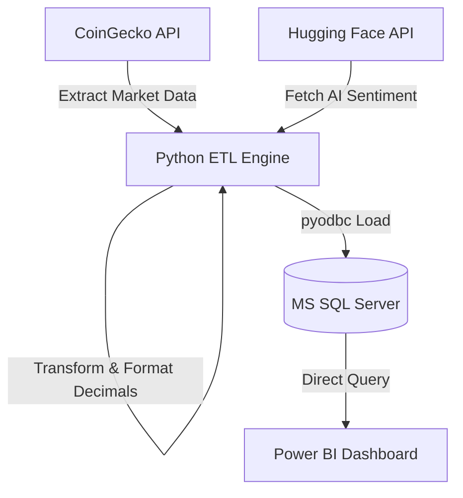

# Live Institutional Crypto Terminal 📊🤖

An end-to-end ETL (Extract, Transform, Load) pipeline and AI-driven sentiment engine that fetches live cryptocurrency market data, runs financial sentiment analysis, loads it into a SQL Server database, and visualizes institutional-grade insights in Power BI.

---

## 🌟 Key Features
- **Real-Time Data Ingestion**: Extracts live price, volume, and market cap metrics for the top 50 cryptocurrencies using the **CoinGecko API**.
- **AI Sentiment Analysis**: Integrates a Hugging Face fine-tuned financial news sentiment analysis model (`distilroberta-finetuned-financial-news-sentiment-analysis`) to gauge asset outlooks.
- **Market Benchmarking**: Computes live market cap benchmarks (mean of top 5 assets) for relative valuation metrics.
- **Native SQL Loader**: Implements robust, transaction-safe database loading into SQL Server via `pyodbc` with precise native decimal formatting.
- **Business Intelligence**: Leverages Power BI to build visual components tracking price trends, market share, and sentiment metrics.

---

## 🏗️ Architecture Flow



---

## 📂 Project Repository Structure
*   [crypto_Terminal_dashboard.ipynb](file:///c:/Users/raman/OneDrive/Documents/CRYPTO%20DASHBOARD%20TERMINAL/crypto_Terminal_dashboard.ipynb): The Jupyter Notebook orchestrating the ETL pipeline.
*   [CRYPTO TERMINAL DASHBOARD.sql](file:///c:/Users/raman/OneDrive/Documents/CRYPTO%20DASHBOARD%20TERMINAL/CRYPTO%20TERMINAL%20DASHBOARD.sql): SQL schema initialization script.
*   [CRYPTO TERMINAL DASHBOARD.pbix](file:///c:/Users/raman/OneDrive/Documents/CRYPTO%20DASHBOARD%20TERMINAL/CRYPTO%20TERMINAL%20DASHBOARD.pbix): Power BI project containing the dashboard layout and data queries.

---

## 🚀 Getting Started

### 1. Database Setup
Ensure you have Microsoft SQL Server installed. Execute the SQL script in [CRYPTO TERMINAL DASHBOARD.sql](file:///c:/Users/raman/OneDrive/Documents/CRYPTO%20DASHBOARD%20TERMINAL/CRYPTO%20TERMINAL%20DASHBOARD.sql) to initialize the target table:

```sql
USE CryptoProject;
GO

CREATE TABLE crypto_prices (
    id VARCHAR(50),
    symbol VARCHAR(10),
    name VARCHAR(100),
    current_price DECIMAL(18, 8),
    market_cap BIGINT,
    market_cap_rank INT,
    total_volume BIGINT,
    high_24h DECIMAL(18, 8),
    low_24h DECIMAL(18, 8),
    price_change_percentage_24h DECIMAL(10, 5),
    sentiment_score VARCHAR(20),
    benchmark_value DECIMAL(24, 2),
    timestamp DATETIME DEFAULT GETDATE()
);
GO
```

### 2. Python Environment Setup
Install the necessary python dependencies:

```bash
pip install pandas requests pyodbc ipykernel
```
*Note: You must have the corresponding SQL Server ODBC Driver (e.g., `ODBC Driver 17 for SQL Server`) installed on your machine.*

### 3. Environment Configuration
Configure your Hugging Face API access token to run the sentiment analysis engine. Set this as an environment variable in your terminal, or use a `.env` configuration file:

```bash
# Windows Command Prompt
set HF_TOKEN=your_huggingface_token_here

# Windows PowerShell
$env:HF_TOKEN="your_huggingface_token_here"
```

In [crypto_Terminal_dashboard.ipynb](file:///c:/Users/raman/OneDrive/Documents/CRYPTO%20DASHBOARD%20TERMINAL/crypto_Terminal_dashboard.ipynb), the script will automatically pick up this environment variable:
```python
HF_TOKEN = os.getenv('HF_TOKEN', 'YOUR_HF_TOKEN')
```

### 4. Run the ETL Pipeline
Open the notebook [crypto_Terminal_dashboard.ipynb](file:///c:/Users/raman/OneDrive/Documents/CRYPTO%20DASHBOARD%20TERMINAL/crypto_Terminal_dashboard.ipynb) in your preferred environment (Jupyter Lab, VS Code, etc.) and run all cells. This will:
1. Extract live data.
2. Formulate sentiment and benchmarks.
3. Clean and push to your SQL Server instance under `CryptoProject.dbo.crypto_prices`.

### 5. Open the Power BI Dashboard
Launch Microsoft Power BI Desktop and open [CRYPTO TERMINAL DASHBOARD.pbix](file:///c:/Users/raman/OneDrive/Documents/CRYPTO%20DASHBOARD%20TERMINAL/CRYPTO%20TERMINAL%20DASHBOARD.pbix). 
- Configure your SQL Server data source credentials if prompted.
- Click **Refresh** to load the newly ingested live metrics.
